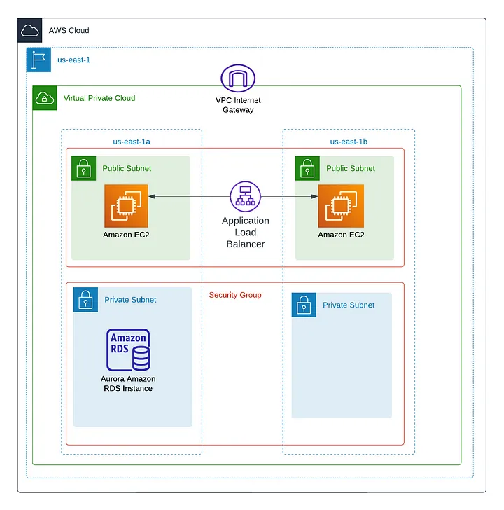

# Aws-two-tier-architecture-service
Create a two tier architecture service through terraform

# What is 2-tier architecture ?
  A 2-Tier architecture, also known as a two-tier architecture, is a model of IT infrastructure that separates application components
into two distinct layers: the presentation layer and the data layer .

  
